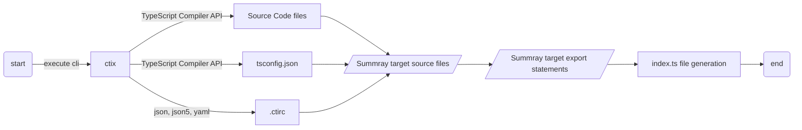
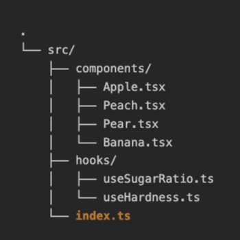
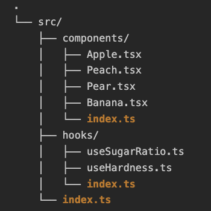
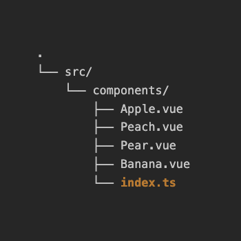

# ctix - Next generation Create TypeScript barrel


[](https://npmcharts.com/compare/ctix?minimal=true)
[](https://github.com/imjuni/ctix)
[](https://github.com/imjuni/ctix/issues)
[](https://www.npmjs.com/package/ctix)
[](https://github.com/imjuni/ctix/blob/master/LICENSE)
[](https://github.com/imjuni/ctix/actions/workflows/ci.yml)
[](https://codecov.io/gh/imjuni/ctix)
[](https://github.com/prettier/prettier)

entrypoint `barrel` file automatically generated cli tool

## Why ctix?

Have you ever developed a library project in the TypeScript language? Unlike API servers or desktop applications, library projects do not have executable scripts or functions. Therefore, it is common to organize a number of functions and variables to be included in the library in an `barrel` file. However, it is inconvenient to rewrite the `barrel` file every time you add a function or variable, and it is easy to make a mistake and miss a function or variable you intended. `ctix` uses the [TypeScript compiler API](https://github.com/microsoft/TypeScript/wiki/Using-the-Compiler-API) to automatically generate the `barrel` file by searching your TypeScript project for functions and variables with the export keyword added.

To summarize,

1. automatically extracts statement with the export keyword applied
1. generate a single `barrel` file or directory-specific `barrel` files
1. automatically generate configuration files via interactive prompts
1. automatically add type keyword to interface, type aliases to indicate they are pure types
   - eg. `export { type IAmSuperHero } from './marvel';`
1. can be set to exception files via comments in source code files (eslint style)
1. always generates a compilable `barrel` file because it uses the TypeScript compiler API

In addition, `ctix` will auto-generate `barrel` files so that a single `index.d.ts` file can be generated correctly when using the [rollup-plugin-dts](https://github.com/Swatinem/rollup-plugin-dts) plugin. Now you can develop your TypeScript library projects more easily!

## Table of Contents <!-- omit in toc -->

- [Why ctix?](#why-ctix)
- [Getting Starts](#getting-starts)
- [How it works?](#how-it-works)
  - [Barrel file](#barrel-file)
- [Installation](#installation)
- [Usage](#usage)
  - [Saving Configuration](#saving-configuration)
  - [include \& exclude file](#include--exclude-file)
    - [How can I include wanted files?](#how-can-i-include-wanted-files)
    - [How can I exclude unwanted files?](#how-can-i-exclude-unwanted-files)
  - [eslint style inline comment](#eslint-style-inline-comment)
    - [@ctix-exclude](#ctix-exclude)
    - [@ctix-exclude-next](#ctix-exclude-next)
    - [@ctix-generation-style](#ctix-generation-style)
    - [@ctix-declaration](#ctix-declaration)
  - [Programming interface](#programming-interface)
- [Requirement](#requirement)
- [Important](#important)
- [Generation Style](#generation-style)
- [More information](#more-information)
- [Examples](#examples)
- [What is difference Re-Map paths?](#what-is-difference-re-map-paths)
- [Option](#option)
- [License](#license)
- [References](#references)

## Getting Starts

```bash
npm install ctix --save-dev
npx ctix init
npx ctix build
```

`ctix` provides interactive prompts to help you create the configuration file. Execute the `ctix init` command to create a configuration file.

## How it works?

The graph below outlines the behavioral flow of `ctix`.



Because `ctix` uses the TypeScript Compiler API to summary target files and extract export statements, developers don't need to write source code in a special format or make any changes to existing code to make it work.

### Barrel file

A [barrel](https://basarat.gitbook.io/typescript/main-1/barrel) is a way to rollup exports from several modules into a single convenient module. The barrel itself is a module file that re-exports selected exports of other modules.

- [TypeScript Deep Dive - barrel](https://basarat.gitbook.io/typescript/main-1/barrel)
- [How we optimized package imports in Next.js](https://vercel.com/blog/how-we-optimized-package-imports-in-next-js)
- [In-Depth guide for TypeScript Library](https://dev.to/imjuni/in-depth-guide-for-typescript-library-project-o1j)

## Installation

```bash
npm install ctix --save-dev
```

## Usage

```bash
# bundle mode
ctix build --mode bundle -p ./tsconfig.json -o ./src

# create mode
ctix build --mode create -p ./tsconfig.json --start-from ./src

# module mode
ctix build --mode module -p ./tsconfig.json -o ./src/components
```

The mode in which the `barrel` file is to be generated. There is a create mode that generates an `barrel` file per directory, a bundle mode that generates a single `barrel` file, and a module mode that generates an `barrel` file by filename for `vue`, `sevelte`, etc.

| `bundle` mode                              | `create` mode                              | `module` mode                              |
| ------------------------------------------ | ------------------------------------------ | ------------------------------------------ |
|  |  |  |

Check out the `.ctirc` in [examples/type10](https://github.com/imjuni/ctix/blob/master/examples/type10/.ctirc) to see how to utilize the `module` mode.

### Saving Configuration

You can save frequently used configurations. ctix supports saving settings in `package.json`, `tsconfig.json`, or a `.ctirc` file. You can easily create a basic configuration using the `ctix init` command.

```bash
# generate base configuration
ctix init
```

### include & exclude file

`ctix` needs a list of files to generate the `index.ts` file. You can provide this list using the `--include` option, which supports glob patterns. If you don't use the `--include` option, ctix will use the `include` setting from the `.ctirc` file. If neither the `--include` option nor the `.ctirc` file is provided, ctix will fall back to the `include` field in the `tsconfig.json` file.

#### How can I include wanted files?

`ctix` gets a glob pattern to generate the `index.ts` file. The glob pattern is obtained from various configuration files such as:

1. Glob pattern from cli argument `--include`
2. Glob patterns from the `include` field in the `.ctirc` configuration file
3. Glob patterns from the `include` field in the `tsconfig.json` configuration file

If your `index.ts` file is empty or a warning is displayed, please check the above configuration.

#### How can I exclude unwanted files?

There are two ways to do this. The first is to create a `.ctirc` file and set the include or exclude value, which works similarly to the include and exclude values in the `tsconfig.json` file. The second is to comment out `@ctix-exclude` at the top of the files you want to exclude, such as eslint.

> `.ctirc`

```json
{
  "options": {
    "mode": "bundle",
    "exclude": ["**/*.storybook.tsx"]
  }
}
```

If you want to use a `.ctirc` file, I recommend creating one with the `npx ctix init` command.

### eslint style inline comment

You can add configurations using eslint-style inline comments.

#### @ctix-exclude

If you want to include an entire directory but exclude certain files, instead of writing a complex glob pattern, you can simply use inline comments to exclude the specific files.

```tsx
/** @ctix-exclude */

const Button = () => {
  return <button>Sample</button>;
};
```

#### @ctix-exclude-next

When exporting multiple classes and functions, you can exclude one or two of them if needed.

```tsx
const Button = () => {};

const GroupButton = () => {};

// @ctix-exclude-next
const UnwantedButton = () => {};

const Checkbox = () => {};
```

#### @ctix-generation-style

```ts
/** @ctix-generation-style default-alias-named-destructive */
const Button = () => {};

const GroupButton = () => {};

// @ctix-exclude-next
const UnwantedButton = () => {};

const Checkbox = () => {};
```

The export syntax in the `index.ts` file is determined by the chosen generation style. For more details, refer to the [More about Generation Style](doc/IN_DEPTH_GEN_STYLE.md) documentation.

#### @ctix-declaration

When `ctix` generates the `index.ts` file, it uses [prettier](https://prettier.io/) and [prettier-plugin-organize-imports](https://www.npmjs.com/package/prettier-plugin-organize-imports) to check if the files to be exported are used. During this process, files that only contain `declare module` are excluded. This can cause issues if you intend to bundle type files. However, if you add `@ctix-declaration` to the file, it will be included in the `index.ts` file. Keep in mind that `@ctix-declaration` is applied after the exclude option, so make sure the file is not included in the exclude option.

> @ctix-declaration does not work when used with export statements in the same file.

```ts
/** @ctix-declaration */

declare module '*.vue' {
  import Vue from 'vue';
  export default Vue;
}
```

### Programming interface

When using task runners like Gulp and Just, as well as bundlers like webpack and rollup, you need a programming interface to add ctix.

| function     | option                                                                                                                                           | descryption                  |
| ------------ | ------------------------------------------------------------------------------------------------------------------------------------------------ | ---------------------------- |
| building     | [TCommandBuildOptions](src/configs/interfaces/TCommandBuildOptions.ts)                                                                           | Execute the `build` command  |
| initializing | [TCommandInitOptions](src/configs/interfaces/TCommandInitOptions.ts)                                                                             | Execute the `init` command   |
| removing     | [TCommandRemoveOptions](src/configs/interfaces/TCommandRemoveOptions.ts), [TCommandBuildOptions](src/configs/interfaces/TCommandBuildOptions.ts) | Execute the `remove` command |

Check out the [example code](doc/PROGRAMMING_INTERFACE.md).

## Requirement

- Node.js 18
- TypeScript

## Important

`ctix` does not work in JavaScript code because it uses TypeScript API, please use it **`before`** Babel translation or TypeScript compilation.

## Generation Style

The handling of the `default export` is an important issue, but many bundlers and type bundlers handle the `default export` differently, so ctix provides many ways to create a `default export`.

You can change the `generation style` of the entire project by setting the `generation-style` option, or you can change the `generation style` of only certain files by adding the `@ctix-generation-style` inline comment at the top of the file.

- [More about Generation Style](doc/IN_DEPTH_GEN_STYLE.md)

## More information

- [Applying a font file to your source code](doc/IN_DEPTH_FONT.md)
- [Applying a Vue.js components to your source code](doc/IN_DEPTH_VUE.md)
- [Applying a include, exclude configuration to `.ctirc`](doc/IN_DEPTH_EXCLUDE.md)

## Examples

In the examples directory, you can find cases where `ctix` has been applied to various projects. For detailed explanations, please refer to the [Examples README.md](examples/README.md) file.

| Directory Name | Purpose                                                                        |
| -------------- | ------------------------------------------------------------------------------ |
| type03         | When there are duplicate names in the entire project                           |
| type05         | For React projects                                                             |
| type06         | When using TypeScript enums                                                    |
| type07         | When using destructive operations on variables for named exports               |
| type09         | When using TTF fonts by declaring them as modules and using them in TypeScript |
| type10         | For Vue.js projects                                                            |
| type11         | When using Component Props in React projects                                   |

## What is difference Re-Map paths?

It is not recommended to use `index.ts` file to re-map paths or shorten the paths. If you want to shorten the paths use [Re-Map paths](https://www.typescriptlang.org/tsconfig#paths) feature in TypeScript compilerOptions. `ctix` is recommended for webpack and rollup.js, typedoc entrypoint and TypeScript declaration file bundling.

## Option

- build command
  - [bundle mode](doc/OPTION_BUILD_BUNDLE.md)
  - [create mode](doc/OPTION_BUILD_CREATE.md)
  - [module mode](doc/OPTION_BUILD_MODULE.md)
- [remove command](doc/OPTION_REVMOE.md)

## License

This software is licensed under the [MIT](LICENSE).

## References

- [AST browser](https://ts-ast-viewer.com/)
- [Tree generator](https://tree.nathanfriend.io/)
