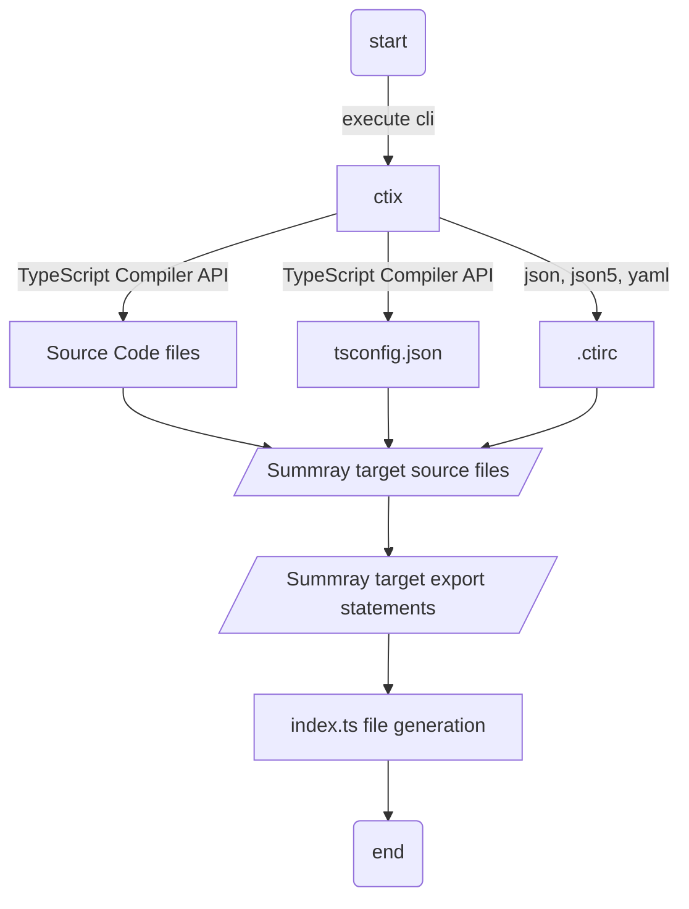

# ctix - Next generation Create TypeScript Index file


[](https://npmcharts.com/compare/ctix?minimal=true)
[](https://github.com/imjuni/ctix)
[](https://github.com/imjuni/ctix/issues)
[](https://www.npmjs.com/package/ctix)
[](https://github.com/imjuni/ctix/blob/master/LICENSE)
[](https://github.com/imjuni/ctix/actions/workflows/ci.yml)
[](https://codecov.io/gh/imjuni/ctix)
[](https://github.com/prettier/prettier)

entrypoint `index.ts` file automatically generated cli tool

## Why ctix?

Have you ever developed a library project in the TypeScript language? Unlike API servers or desktop applications, library projects do not have executable scripts or functions. Therefore, it is common to organize a number of functions and variables to be included in the library in an `index.ts` file. However, it is inconvenient to rewrite the `index.ts` file every time you add a function or variable, and it is easy to make a mistake and miss a function or variable you intended. `ctix` uses the [TypeScript compiler API](https://github.com/microsoft/TypeScript/wiki/Using-the-Compiler-API) to automatically generate the `index.ts` file by searching your TypeScript project for functions and variables with the export keyword added.

To summarize,

1. automatically extracts statement with the export keyword applied
1. generate a single `index.ts` file or directory-specific `index.ts` files
1. automatically generate configuration files via interactive prompts
1. automatically add type keyword to interface, type aliases to indicate they are pure types
    - eg. `export { type IAmSuperHero } from './marvel';`
1. can be set to exception files via comments in source code files (eslint style)

In addition, `ctix` will auto-generate `index.ts` files so that a single `index.d.ts` file can be generated correctly when using the [rollup-plugin-dts](https://github.com/Swatinem/rollup-plugin-dts) plugin. Now you can develop your TypeScript library projects more easily!

## Table of Contents <!-- omit in toc -->

- [Why ctix?](#why-ctix)
- [Getting Starts](#getting-starts)
- [How it works?](#how-it-works)
- [Installation](#installation)
- [Usage](#usage)
- [Requirement](#requirement)
- [Important](#important)
- [More information](#more-information)
- [What is difference Re-Map paths?](#what-is-difference-re-map-paths)
- [Option](#option)

## Getting Starts

```bash
npm install ctix --save-dev
npx ctix init
npx ctix build
```

`ctix` provides interactive prompts to help you create the configuration file. Execute the `ctix init` command to create a configuration file.

## How it works?

The graph below outlines the behavioral flow of `ctix`.



Because `ctix` uses the TypeScript Compiler API to summary target files and extract export statements, developers don't need to write source code in a special format or make any changes to existing code to make it work.

## Installation

```bash
npm install ctix --save-dev
```

## Usage

```bash
ctix build -p ./tsconfig.json -o ./src
```

## Requirement

- Node.js 18
- TypeScript

## Important

`ctix` does not work in JavaScript code because it uses TypeScript API, please use it **`before`** Babel translation or TypeScript compilation.

## More information

- [Applying a font file to your source code](https://github.com/imjuni/ctix/blob/master/doc/IN_DEPTH_FONT.md)
- [Applying a Vue.js components to your source code](https://github.com/imjuni/ctix/blob/master/doc/IN_DEPTH_VUE.md)
- [Applying a include, exclude configuration to `.ctirc`](https://github.com/imjuni/ctix/blob/master/doc/IN_DEPTH_IGNORE.md)

## What is difference Re-Map paths?

It is not recommended to use `index.ts` file to re-map paths or shorten the paths. If you want to shorten the paths use [Re-Map paths](https://www.typescriptlang.org/tsconfig#paths) feature in TypeScript compilerOptions. `ctix` is recommended for webpack and rollup.js, typedoc entrypoint and TypeScript declaration file bundling.

## Option

- build command
  - [bundle mode](https://github.com/imjuni/ctix/blob/master/doc/OPTION_BUILD_BUNDLE.md)
  - [create mode](https://github.com/imjuni/ctix/blob/master/doc/OPTION_BUILD_CREATE.md)
- [remove command](https://github.com/imjuni/ctix/blob/master/doc/OPTION_REVMOE.md)
