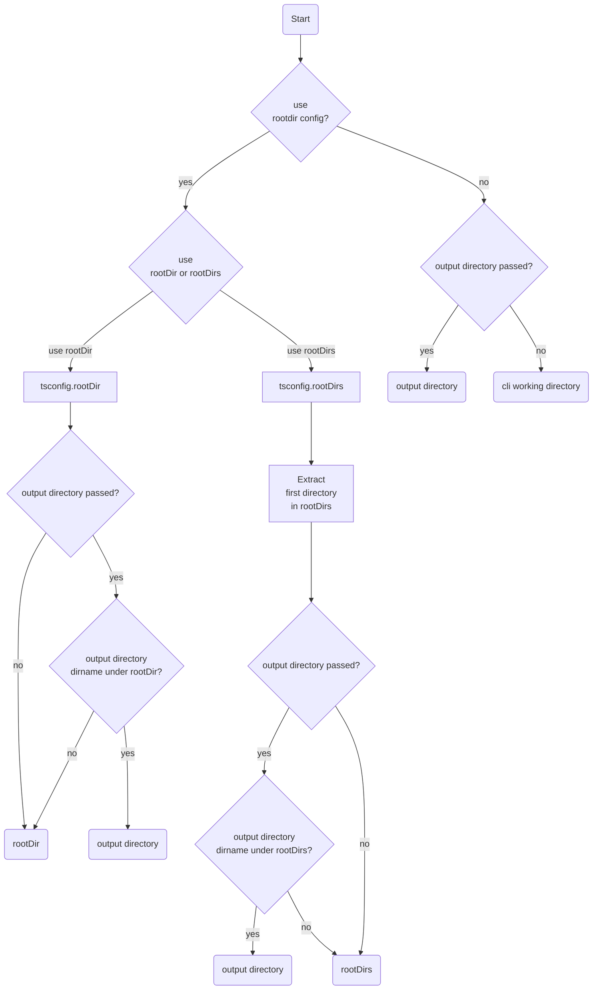

useRootDir and output directory option workflow

```mermaid
graph TD

A01(Start)
C01[tsconfig.rootDir]
C02[tsconfig.rootDirs]

A01-->A02{use<br />rootdir config?}
A02-->|yes|A03{use<br /> rootDir or rootDirs}
A03-->|use rootDir|C01
C01-->A04{output directory passed?}
A04-->|yes|A05{output directory<br /> dirname under rootDir?}
A04-->|no|Z01(rootDir)
A05-->|yes|Z02(output directory)
A05-->|no|Z01

A03-->|use rootDirs|C02
C02-->A06[Extract<br /> first directory<br /> in rootDirs]
A06-->A07{output directory passed?}
A07-->|yes|A08{output directory<br /> dirname under rootDirs?}
A08-->|yes|Z03(output directory)
A08-->|no|Z04(rootDirs)
A07-->|no|Z04

A02-->|no|A09{output directory passed?}
A09-->|yes|D01(output directory)
A09-->|no|B01(cli working directory)
```
